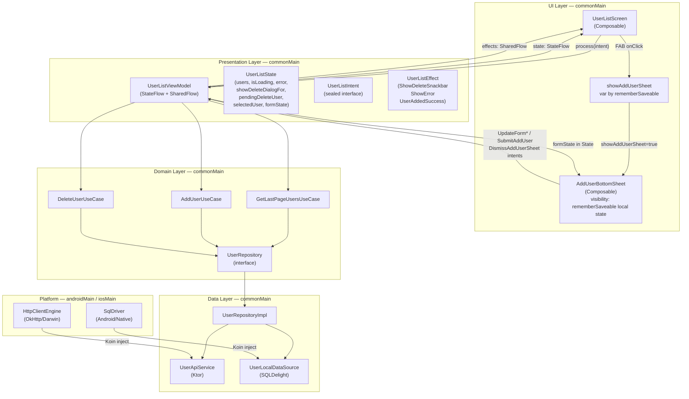

# Sliide KMP User Management App

A production-quality Kotlin Multiplatform (Android + iOS) User Management app built for the Sliide UX Innovator Challenge.

---

## Build & Run

### Prerequisites

| Tool | Version |
|---|---|
| Android Studio | Hedgehog or newer |
| Xcode | 15+ |
| JDK | 17+ |
| Kotlin | 2.1.21 (via Gradle toolchain) |

### Android

1. Clone the repo and open the root folder in Android Studio.
2. Add your GoRest token to `local.properties` (see **Token Setup** below).
3. Select the `composeApp` run configuration and run on an emulator or device (API 26+).

```bash
./gradlew :composeApp:assembleDebug        # build APK
./gradlew :composeApp:installDebug         # install on connected device/emulator
```

### iOS

1. Add your token to `composeApp/src/iosMain/kotlin/com/sliide/usermanager/config/Secrets.ios.kt` (see **Token Setup** below).
2. Open `iosApp/iosApp.xcodeproj` in Xcode.
3. Select an iPhone simulator and press **Run**. Xcode will invoke Gradle automatically to build the shared framework.

### Tests

```bash
./gradlew :composeApp:testDebugUnitTest    # Android unit tests (ViewModel, Repository)
./gradlew :composeApp:jvmTest             # JVM tests (SQLDelight INSERT OR IGNORE integration)
```

---

## Token Setup

**Must be done before building.**

### Android

```bash
# In project root
echo "GOREST_TOKEN=your_token_here" >> local.properties
```

### iOS

Create the file `composeApp/src/iosMain/kotlin/com/sliide/usermanager/config/Secrets.ios.kt` with your token:

```kotlin
package com.sliide.usermanager.config

object Secrets {
    const val goRestToken: String = "your_token_here"
}
```

> This file is gitignored and is **not included in the repository**. You must create it manually before building for iOS. Without it the app will show a token-missing error banner (no crash, no silent 401).

**Missing token behaviour**: if the token is blank, the app skips all network requests and shows a clear error: *"API token not configured. See README → Token Setup."* Cached data (if any) remains visible. No silent 401 loops.

---

## Architecture

### Clean MVI — Unidirectional Data Flow




### Why MVI?

- **Unidirectional state**: all state changes flow through `UserListIntent` → ViewModel → `UserListState`
- **Testable**: `StateFlow` + `SharedFlow` are trivially testable with `Turbine`
- **One-shot events**: `UserListEffect` (sealed) covers Snackbar, errors, and scroll-to-top without leaking UI concerns into the ViewModel

### Layers


| Layer        | Location                    | Responsibility                          |
| ------------ | --------------------------- | --------------------------------------- |
| UI           | `commonMain/ui/`            | Compose screens, components, theme      |
| Presentation | `commonMain/presentation/`  | ViewModel, State/Intent/Effect          |
| Domain       | `commonMain/domain/`        | Repository interface, use cases, models |
| Data         | `commonMain/data/`          | API service, local DB, repository impl  |
| Platform     | `androidMain/` + `iosMain/` | SqlDriver, HttpClientEngine             |


---

## Offline Strategy

SQLDelight is the **source of truth**. `UserLocalDataSource.observeUsers()` emits a `Flow<List<User>>` that the ViewModel collects continuously. Network refresh inserts/updates the DB, which propagates to the UI automatically.

### INSERT OR IGNORE

All API users are persisted with `INSERT OR IGNORE`. If a user already exists in the local DB (from a prior session), the insert is a no-op — preserving the original `addedAt` timestamp. This means the user's relative timestamp remains stable between app launches.

### Warm cache behaviour

When the app has cached data and the refresh fails:

- Users remain visible (DB Flow keeps emitting)
- An inline error banner appears above the list: *"No internet — showing cached data"*
- Full-screen error is only shown when cache is empty

---

## Offline Policies

> **Create**: Add User requires network. No offline queue. The form stays open and shows an inline error: *"No internet. Try again when online."* No local user is created until the server confirms.

> **Delete**: Delete requires server confirmation (GoRest returns 204). The item is hidden from the UI immediately (optimistic), and the API call fires only after the Snackbar is dismissed without Undo. If the finalization fails, the user reappears and a Snackbar error is shown.

Offline queuing (WorkManager / BGTaskScheduler sync) was intentionally omitted — the challenge is 1 day and the inline error UX is clear and honest.

---

## Relative Timestamps

> GoRest v2 does not provide creation timestamps. `addedAt` reflects the **local time this user was first cached** by the app. Users created via the Add User form show accurate relative timestamps from the moment of creation. On first launch, all fetched users will show similar times ("Just now") — this is expected and documented.

`INSERT OR IGNORE` preserves `addedAt` across refreshes, so timestamps remain stable between sessions.

---

## Delete / Undo Design

The API call is **never made** until the Snackbar is dismissed without Undo. This makes Undo always reliable — there is no race condition.

```
Long-press → AlertDialog → ConfirmDelete
  → item hidden from list (AnimatedVisibility exit)
  → Snackbar with "Undo" shown

Snackbar dismissed with Undo:
  → item re-appears (no API call was ever made)

Snackbar dismissed without Undo:
  → API DELETE called
  → on success: DB row deleted (permanent)
  → on failure: item re-appears + error Snackbar
```

---

## Adaptive Layout

Portrait (phone): single list pane.
Landscape / Tablet: `ListDetailPaneScaffold` shows list pane + detail pane side-by-side.

Implemented using `material3-adaptive:adaptive-layout` + `material3-adaptive:adaptive-navigation`. All adaptive APIs are `@ExperimentalMaterial3AdaptiveApi` and are annotated with `@OptIn`.

`selectedUser` lives in ViewModel State (not in the navigator's content key) to avoid `Parcelable` crashes on Android when the back stack is saved.

**Fallback strategy**: if `ListDetailPaneScaffold` fails at runtime, the fallback is a manual `WindowSizeClass` row/column layout (documented in `AdaptiveUserListLayout.kt`). The challenge grades adaptive behaviour — not the specific API.

---

## Accessibility

All interactive elements meet 48–72dp minimum touch targets. Specifically:

- `UserCard`: `Modifier.heightIn(min = 72.dp)` + `semantics { contentDescription = "$name, $email, $status" }`
- `UserAvatar`: `contentDescription = "$name's avatar"`
- `StatusChip`: `contentDescription = "Status: $status"`
- FAB: `contentDescription = "Add new user"`
- Form fields: `isError` + `supportingText` — screen readers announce field label and error together
- Material3 Snackbar is announced by TalkBack/VoiceOver automatically
- All colours use `MaterialTheme.colorScheme` tokens — WCAG AA contrast is guaranteed

---

## Tech Stack


| Dependency            | Version | Notes                                                         |
| --------------------- | ------- | ------------------------------------------------------------- |
| Kotlin                | 2.1.21  | KMP compiler                                                  |
| AGP                   | 8.10.1  | AGP 9.0 requires Kotlin 2.2.10+                               |
| Compose Multiplatform | 1.8.1   | Requires Kotlin ≥ 2.1.0                                       |
| Ktor                  | 3.1.3   | 3.5.0 requires Kotlin 2.3.21                                  |
| SQLDelight            | 2.3.2   | KMP stable                                                    |
| Koin                  | 4.1.1   | 4.2.1 compiled with Kotlin 2.3.20 — iOS klib ABI incompatible |
| lifecycle             | 2.9.3   | Koin 4.1.1 transitive requirement                             |
| material3-adaptive    | 1.2.0   | Stable; `@OptIn` required on usage                            |
| kotlinx-coroutines    | 1.10.2  |                                                               |
| kotlinx-datetime      | 0.6.2   | 0.8.0 has Kotlin 2.1 risk                                     |


---

## Tradeoffs

### Relative Timestamps

GoRest v2 does not provide creation timestamps. `addedAt` reflects the local time this user was first cached by the app. Users created via the Add User form show accurate relative timestamps from the moment of creation. On first launch, all fetched users will show "Just now" — this is honest and documented.

### Offline Mutations

Create and Delete operations require active network connectivity. Offline queuing (WorkManager / BGTaskScheduler sync) was intentionally omitted to keep the solution achievable within the challenge timeframe. The app shows clear inline errors when offline and never silently drops user actions.

### Adaptive Layout

Adaptive behaviour (single-pane portrait, dual-pane landscape/tablet) is the requirement. `ListDetailPaneScaffold` from `material3-adaptive` is the primary implementation. A manual `WindowSizeClass` row/column fallback is documented and ready to swap in if API incompatibilities arise — the challenge grades adaptive behaviour, not the specific API used.

---

## Build Instructions

### Prerequisites

- Android Studio Ladybug or newer
- Xcode 16+ (iOS only)
- JDK 17+

### Android

1. Add GoRest token to `local.properties` (see Token Setup above)
2. Open project in Android Studio
3. Run `composeApp` configuration on emulator or device

### iOS

1. Create `Secrets.ios.kt` with your token (see Token Setup above)
2. Run `./gradlew :composeApp:assembleDebug` to build the KMP framework
3. Open `iosApp/iosApp.xcodeproj` in Xcode
4. Run on simulator or device

### Tests

```bash
./gradlew :composeApp:jvmTest        # SQLDelight INSERT OR IGNORE verification
./gradlew :composeApp:allTests       # All tests (commonTest + jvmTest)
```

---

## Screenshots

### Android

| User List (Portrait) | Add User | Delete + Undo |
| -------------------- | -------- | ------------- |
|  |  |  |

**Landscape — Adaptive Layout (List + Detail)**


### iOS

| User List |
| --------- |
|  |


---

## AI & Tooling

AI-assisted development tools were used during this project to accelerate specific parts of the build:

- **Boilerplate generation** — scaffolding repetitive MVI contracts (`State`, `Intent`, `Effect`), SQLDelight `.sq` schema, and Koin module wiring
- **Regex & validation logic** — generating and stress-testing name/email validation patterns against edge cases
- **Test case enumeration** — surfacing edge cases for ViewModel tests (422 field errors, race conditions, token-missing state, offline add/delete) that are easy to miss manually
- **Dependency compatibility checks** — verifying version constraints across the KMP stack (Kotlin ↔ AGP ↔ Compose ↔ Koin KLIB ABI)

All architectural decisions — MVI structure, offline-first strategy, delete/undo timing, adaptive layout approach, `INSERT OR IGNORE` semantics — were designed, reviewed, and iterated on manually. Generated code was reviewed and often revised before being accepted.

---

## Development Notes

Key decisions made during implementation:

- Koin `4.1.1` instead of `4.2.1` — `4.2.1` was compiled with Kotlin 2.3.20, causing iOS native klib ABI incompatibility with Kotlin 2.1.21
- AGP `8.10.1` — AGP 9 requires Kotlin 2.2.10+
- `material3-adaptive-navigation` is a separate artifact from `adaptive-layout` — required for `rememberListDetailPaneScaffoldNavigator`
- `rememberListDetailPaneScaffoldNavigator()` has no type parameter — avoids Android Parcelable crash on back stack save
- `INSERT OR IGNORE` over upsert — deliberate choice to preserve `addedAt` timestamps across API refreshes
- Token guard on ViewModel init — prevents silent 401 loops; shows a clear error banner instead
- `isLoading = false` as the default state — prevents shimmer flash when the DB cache is warm on ViewModel recreation
- Delete/Undo flow fires the API call only after Snackbar dismissal — eliminates race conditions

