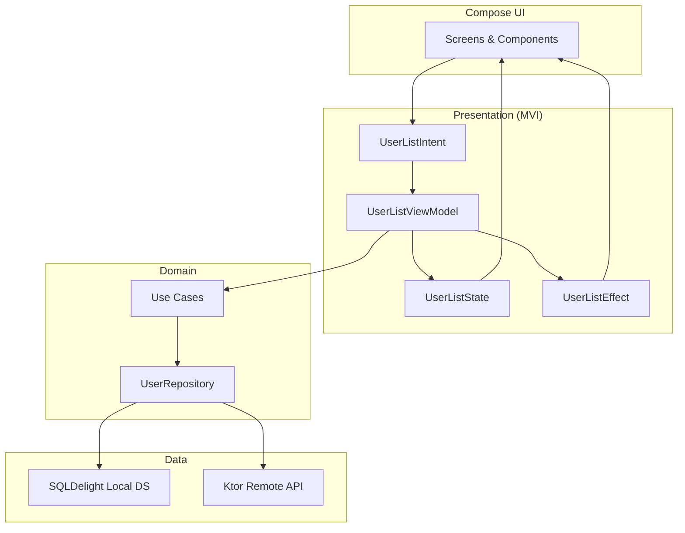

# Sliide KMP User Management

[](https://github.com/kanav22/sliide-kmp-user-management/actions/workflows/ci.yml)
[](https://kotlinlang.org)
[](https://www.jetbrains.com/compose-multiplatform/)
[](LICENSE)

Offline-first **Kotlin Multiplatform** user management app — **MVI**, **SQLDelight**, **Ktor**, and **Compose Multiplatform** on Android, iOS, and Desktop.

> Reference implementation for production KMP architecture: unidirectional data flow, cache-first UX, and CI-backed quality gates.

**Author:** [Kanav Wadhawan](https://github.com/kanav22) · [Portfolio](https://www.kanavwadhawan.com)

---

## Why this exists

Most KMP samples stop at "Hello World." This repo shows architecture decisions that survive production:

- **MVI** with explicit `State`, `Intent`, and `Effect` boundaries
- **Offline-first** reads from SQLDelight; network syncs in the background
- **Shared UI** across Android, iOS, and JVM with platform-specific DI and theme hooks
- **CI pipeline** that runs tests on every push

Read the full architecture write-up: [MVI, Offline-First, and KMP](docs/architecture/kmp-mvi-offline-first.md)

---

## Architecture



---

## Features

- User list with pull-to-refresh and shimmer loading states
- Add and delete users with optimistic UI updates
- Offline-first: local cache via SQLDelight, sync when online
- Adaptive layout for phone and tablet (list + detail pane)
- Shared Compose UI on Android, iOS, and Desktop (JVM)

---

## Tech stack

| Layer | Technology |
|-------|------------|
| Language | Kotlin Multiplatform |
| UI | Compose Multiplatform, Material 3 |
| Architecture | MVI (Model-View-Intent) |
| DI | Koin |
| Networking | Ktor Client |
| Persistence | SQLDelight |
| Async | Coroutines + Flow |
| Testing | kotlin.test, Turbine |

---

## Quick start

### Prerequisites

- JDK 17+
- Android Studio Ladybug or newer (for Android)
- Xcode 15+ (for iOS, macOS only)

### Run

```bash
git clone https://github.com/kanav22/sliide-kmp-user-management.git
cd sliide-kmp-user-management

# Android
./gradlew :composeApp:assembleDebug

# Desktop (JVM)
./gradlew :composeApp:run

# iOS — open iosApp/iosApp.xcodeproj in Xcode
```

### Test

```bash
./gradlew :composeApp:allTests
```

---

## Project structure

```
composeApp/
├── commonMain/     Shared UI, domain, data, MVI, SQLDelight
├── androidMain/    Android entry point, platform DI
├── iosMain/        iOS entry point, platform DI
├── jvmMain/        Desktop entry point
└── commonTest/     ViewModel and domain tests
iosApp/             Xcode wrapper for iOS
docs/               Architecture docs and deep dives
```

---

## Documentation

| Doc | Description |
|-----|-------------|
| [Architecture: MVI + Offline-First + KMP](docs/architecture/kmp-mvi-offline-first.md) | Production architecture decisions |
| [Code walkthrough](docs/CODE_WALKTHROUGH.md) | Guided tour of the codebase |
| [Technical deep dive](docs/TECHNICAL_DEEP_DIVE.md) | Implementation details |

---

## Related projects

| Repo | Focus |
|------|-------|
| [android-platform-starter](https://github.com/kanav22/android-platform-starter) | Production Android platform template |
| [compose-golden-toolkit](https://github.com/kanav22/compose-golden-toolkit) | Paparazzi golden testing patterns |
| [kanav22](https://github.com/kanav22/kanav22) | Profile & writing |

---

## Contributing

See [CONTRIBUTING.md](CONTRIBUTING.md).

---

## License

MIT — see [LICENSE](LICENSE).
